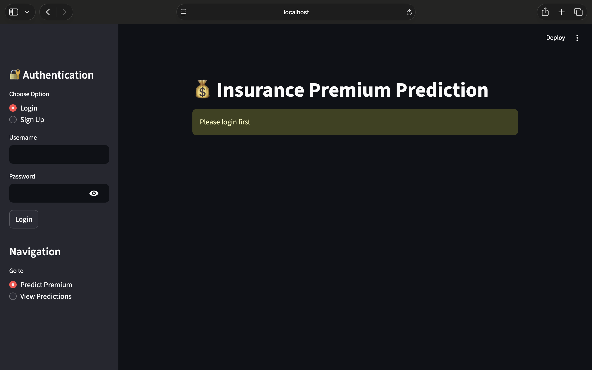
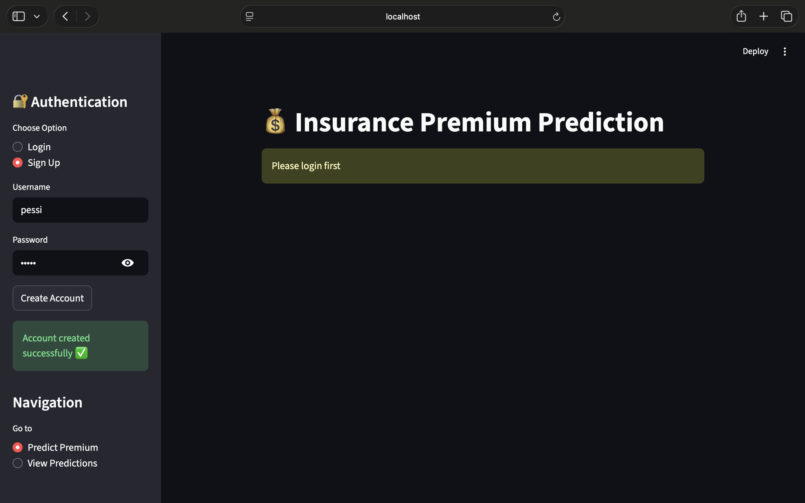
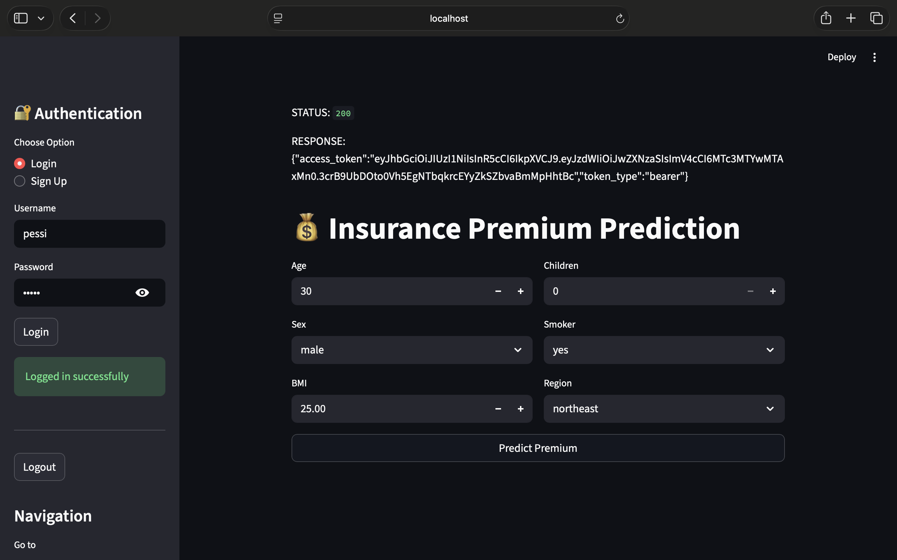
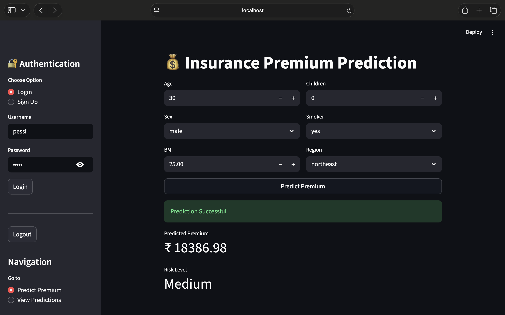
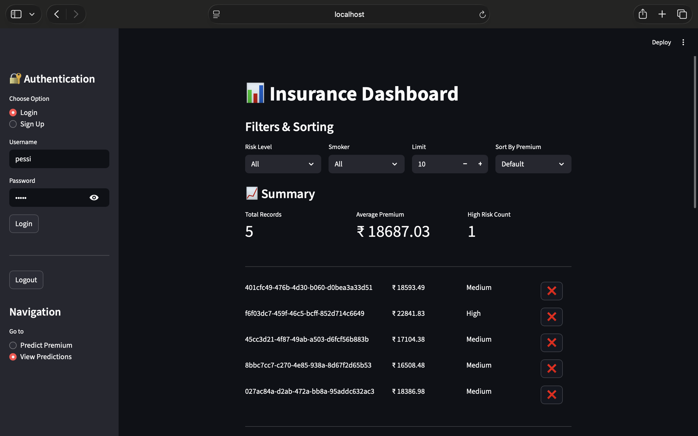
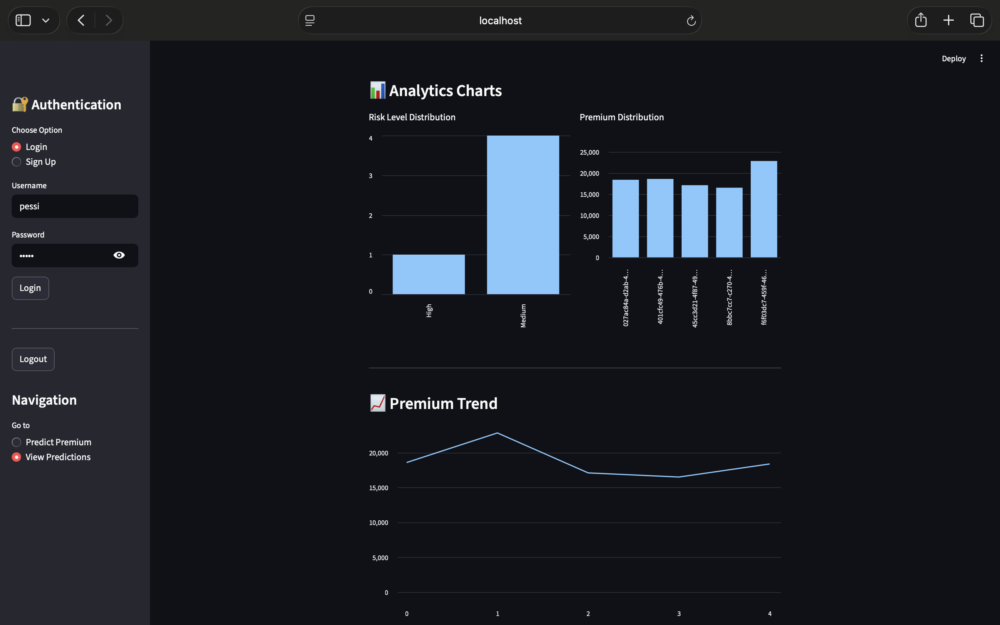

# 🏥 Insurance Premium Prediction System

A full-stack Machine Learning project that predicts insurance premium based on user input.

---

## 🚀 Live Demo

**Frontend (Streamlit):**  
https://insurance-premium-2905.streamlit.app  

**Backend (FastAPI Swagger Docs):**  
http://15.206.73.171:8000/docs  

---

## 📌 Project Architecture

Streamlit (Frontend)  
⬇  
FastAPI (Backend API)  
⬇  
PostgreSQL (Database)  
⬇  
Machine Learning Model (Scikit-learn)

---

## 🧠 Features

- User Registration & Login (JWT Authentication)
- Secure Password Hashing (Passlib + Bcrypt)
- Insurance Premium Prediction using ML Model
- PostgreSQL Database Integration
- Dockerized Backend Deployment on AWS EC2
- Streamlit Cloud Deployment for Frontend

---

## 🛠 Tech Stack

### 🔹 Frontend
- Streamlit
- Requests
- Pandas

### 🔹 Backend
- FastAPI
- SQLAlchemy
- PostgreSQL
- JWT Authentication
- Uvicorn

### 🔹 Machine Learning
- Scikit-learn
- Pandas
- NumPy

### 🔹 Deployment
- Docker
- AWS EC2
- Streamlit Cloud

---

## 📷 Application Preview

---

## ⚙️ How to Run Locally

### 1️⃣ Clone Repository

git clone https://github.com/ohm2905/Insurance-premium.git

cd Insurance-premium

### 2️⃣ Run Backend (Docker)
docker-compose up --build

Backend will run on:
http://localhost:8000/docs

3️⃣ Run Streamlit

streamlit run streamlit_app.py

🔐 Environment Variables

Create a .env file in the root directory:

SECRET_KEY=your_secret_key
DATABASE_URL=your_database_url

👨‍💻 Author

Ohm Kumar
B.Tech CSE Student
